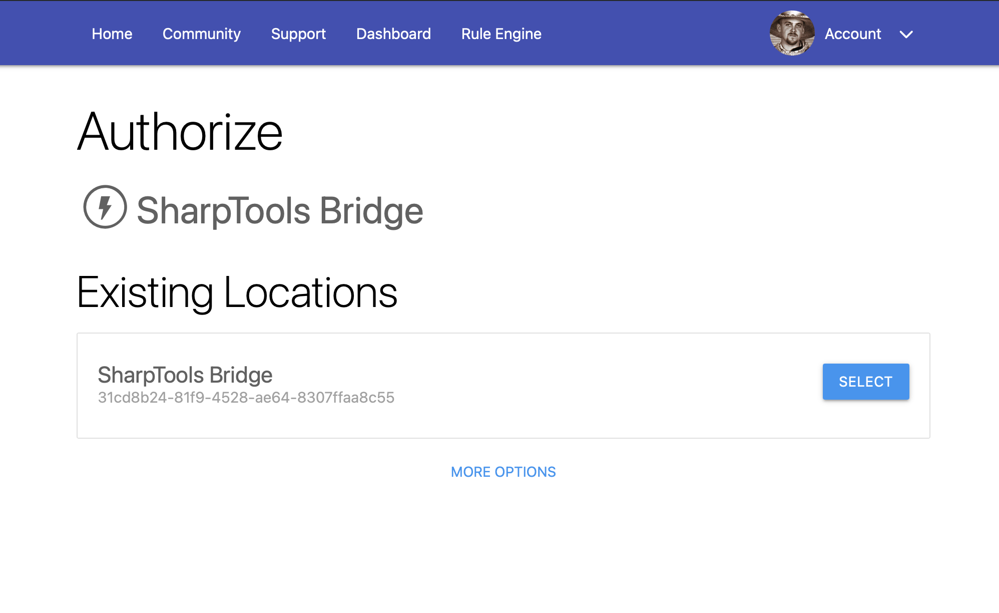
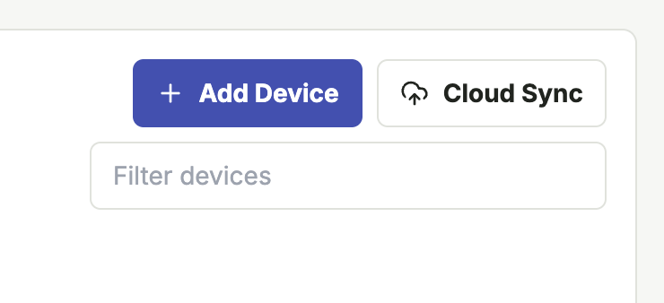

# Connect Bridge to SharpTools

Bridge connects to SharpTools Cloud using a local pairing flow.

Once connected, Bridge can send selected local resources to SharpTools Cloud so they can be used in dashboards and rules.

## Pair Bridge

1. Open the local Bridge UI.
2. Go to **System > Cloud Connection**.
3. Select **Connect SharpTools**.
4. Sign in to SharpTools if prompted.
5. Create a new Bridge Location or select an existing
6. Return to the Bridge UI and confirm the connection status.

After pairing, Bridge stores the cloud location connection locally and maintains an outbound connection to SharpTools Cloud.

::: tip Not seeing an expected location?
When authorizing SharpTools Bridge for the first time, you'll need to create a new 'Location' for the bridge to sync to. If you previously authorized a bridge to SharpTools, those existing locations may be displayed for you to select.

If you aren't seeing an expected existing Bridge location, tap the 'More Options' link at the bottom.
:::

## Select Resources for SharpTools

Bridge does not automatically sync every local resource to SharpTools.

To choose what should appear in SharpTools:

1. Open **Devices** in the Bridge UI.
2. Tap the **Cloud Sync** button
3. Check the boxes next to the devices you would like synced
4. Tap the **Sync Now** button to complete the synchronization

::: info
Some setup flows also include a final resource selection step, but the 'Cloud Sync' button on the Devices page of the Bridge UI is the most consistent way to manage cloud sync selections.
:::

## What Sync Means

When a resource is selected for sync:

- Bridge includes that resource in cloud entity requests.
- SharpTools can create or update the corresponding cloud device.
- Commands from SharpTools can route back through Bridge to the local resource.
- Local state changes can be sent from Bridge back to SharpTools.

## Troubleshooting: Missing Devices in SharpTools

If a selected resource does not appear in SharpTools:

1. Confirm Bridge is connected in **System > Cloud Connection**.
2. Confirm the resource is selected for Cloud Sync.
3. Run a manual sync (Devices > Cloud Sync > Sync Now).
4. Check **System > Logs** for cloud or sync errors.
5. Check the relevant integration logs for local device errors.

## Disconnecting

If the Bridge location is deleted from SharpTools Cloud, Bridge clears local pairing information and disconnects from SharpTools Cloud after acknowledging the delete request.

To reconnect, repeat the pairing flow from **System > Cloud Connection**.
