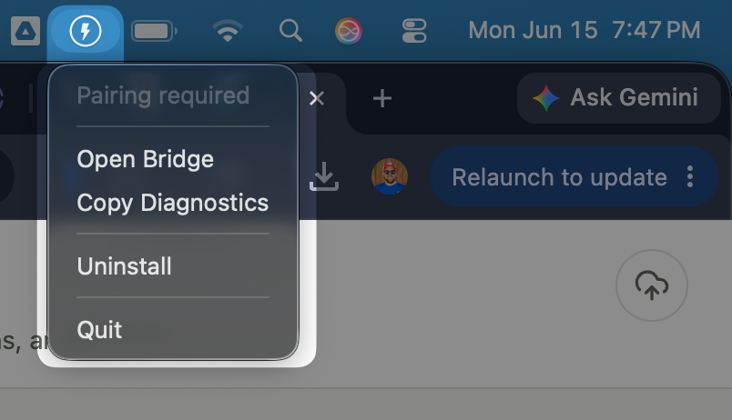
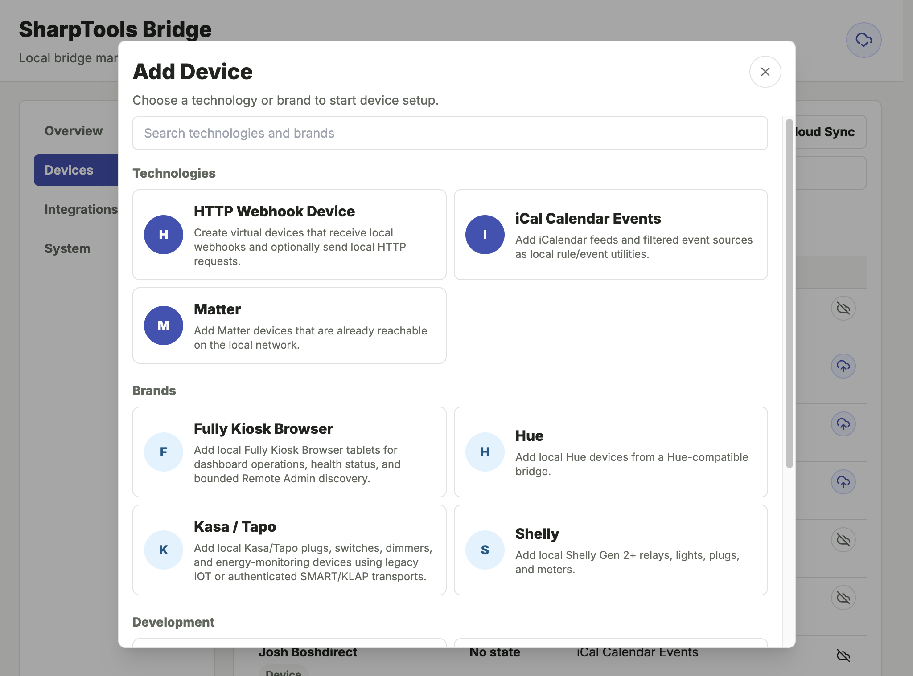
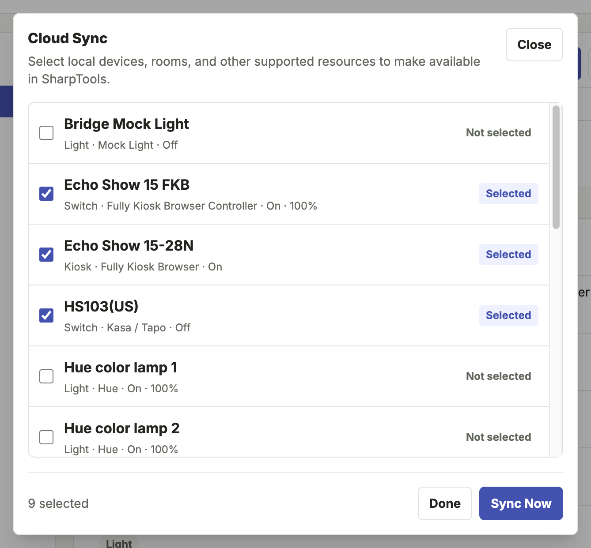

<script setup>
import BridgeReleaseDownloads from '../.vitepress/theme/components/BridgeReleaseDownloads.vue'
</script>

# Getting Started with Bridge

This guide walks through the basic Bridge Alpha flow.

## Before You Begin

You will need:

- A SharpTools account with Bridge Alpha access.
- A device that can run Bridge locally, such as a Linux host, NAS, home server, always-on desktop Mac or Windows PC, or another machine that stays awake.
- Access to the local network where your devices live.
- A supported device or integration to test.

Bridge should run on a machine that is normally available. Desktops, NAS, or dedicated always-on mini computers are excellent choices.

::: tip Local Network Required
Many Bridge integrations depend on local network access, discovery, or direct device communication. For desktop users, the Windows and macOS installers are usually the best fit. For dedicated Linux hosts and NAS devices, Docker with host networking usually has the best LAN discovery behavior.
:::

## Choose an Install Path

Pick the install path that best matches the machine where Bridge will stay running.

- **Windows installer:** good for always-on desktop-style Windows PCs. The installer runs Bridge as a background service and includes a system tray app.
- **macOS installer:** good for always-on desktop-style Macs. The installer runs Bridge as a background service and includes a menu bar app.
- **Docker:** good for Linux servers, NAS devices, and power-user environments where host networking is available.
- **Standalone binary:** useful for Linux testers and advanced/manual setups.

::: code-group

<div class="vp-block" data-title="Windows Installer">

<ol>
  <li>
    <strong>Download and install Bridge.</strong>
    <BridgeReleaseDownloads target="windows" />
  </li>
  <li>Use the SharpTools Bridge system tray app to open the local Bridge UI.</li>
  <li>Keep the Windows PC awake and available on your local network.</li>
</ol>

</div>

<div class="vp-block" data-title="macOS Installer">

<ol>
  <li>
    <strong>Download and install Bridge.</strong>
    <BridgeReleaseDownloads />
  </li>
  <li>Use the SharpTools Bridge menu bar app to open the local Bridge UI.</li>
  <li>Keep the Mac awake and available on your local network.</li>
</ol>

</div>

```bash [Docker Run]
docker run -d \
  --name sharptools-bridge \
  --restart unless-stopped \
  --network host \
  -v sharptools-bridge-data:/data \
  ghcr.io/sharptools-io/bridge:alpha
```

```yaml [Docker Compose]
services:
  bridge:
    image: ghcr.io/sharptools-io/bridge:alpha
    container_name: sharptools-bridge
    restart: unless-stopped
    network_mode: host
    volumes:
      - sharptools-bridge-data:/data

volumes:
  sharptools-bridge-data:
```

<div class="vp-block" data-title="Linux Binary">

<ol>
  <li>
    <strong>Download and unpack the Linux binary.</strong>
    <BridgeReleaseDownloads target="linux" />
  </li>
  <li>Extract the archive on the Linux host where Bridge will stay running.</li>
  <li>Run <code>SHARPTOOLS_BRIDGE_HOME=/var/lib/sharptools-bridge ./sharptools-bridge</code> from the extracted folder for a quick terminal test, or run it from your preferred service manager.</li>
  <li>Open <code>http://&lt;linux-host&gt;:8787/</code> from a browser on your local network.</li>
</ol>

</div>

:::

The Docker examples above are best suited to Linux hosts, NAS devices, and server-style environments that support host networking. They rely on the defaults built into the Bridge image: `/data` for persistent storage, `8787` for the local admin UI, and `0.0.0.0` for local-network access.

For most Windows and macOS desktop users, use the native installer instead of Docker Desktop. Docker Desktop port mapping is usually enough for the Bridge UI and outbound cloud connection, but it can interfere with mDNS, UDP broadcast, Matter commissioning, and other local discovery behavior. If you still want to use Docker Desktop, review the warnings in [Install with Docker](./install-docker) before choosing that path.

## Basic Flow

1. Install and start Bridge using one of the install paths above.
2. Open the local Bridge admin UI at `http://<bridge-host>:8787/`.
3. Follow the onboarding guidance in Bridge to connect SharpTools Cloud, add a local integration, and sync selected resources.
4. Use synced resources in SharpTools dashboards and rules like other SharpTools devices.
5. Check **System > Logs** if setup, sync, or commands do not work as expected.

## Open the Bridge UI

After Bridge starts, open the local admin UI from a browser on your local network:

```text
http://<bridge-host>:8787/
```

If you are running Bridge on the same computer you are using to browse:

```text
http://localhost:8787/
```

::: tip macOS Menu Bar
macOS installer users can open the **SharpTools Bridge** app and choose **Open Bridge** from the SharpTools menu bar icon.
:::



The Bridge UI includes:

- **Overview** for first-run setup and high-level status.
- **Devices** for local resources, controls, details, and SharpTools Cloud Sync selection.
- **Integrations** for configured drivers and setup flows.
- **System** for cloud connection, updates, logs, runtime information, network details, and experimental Labs features.

## Add Your First Integration

From the Bridge UI:

1. Select **Add Device**.
2. Choose a supported integration.
3. Complete the setup flow.
4. Select the resources you want to sync to SharpTools.

Some integrations can discover devices automatically. Others require a host, URL, setup code, or credentials.



## Use Bridge Devices in SharpTools

From the **Devices** tab, use **Cloud Sync** to choose which Bridge resources should be available in SharpTools Cloud.

Once selected resources have synced, they can be used in SharpTools dashboards and rules like other SharpTools devices.



## Share Feedback

When reporting feedback, include:

- How you installed Bridge.
- Which integration or device you tested.
- What worked.
- What did not work.
- Relevant screenshots or Bridge logs.
- Any network details that might matter, such as Docker host networking, VLANs, or Docker Desktop port mapping.
