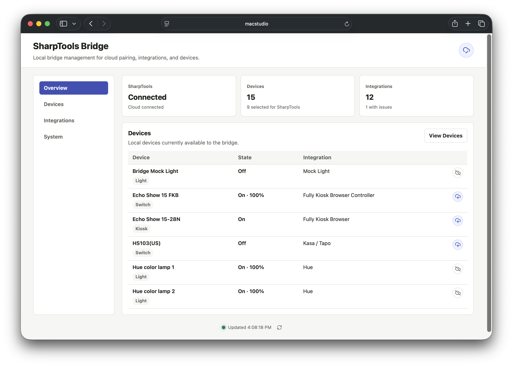

# SharpTools Bridge Alpha

SharpTools Bridge is a local runtime that runs on your network and connects supported local devices and services back into SharpTools.

> [!NOTE]
> Bridge is currently available as a private alpha. The alpha is focused on validating the core setup, pairing, local integration, cloud sync, and troubleshooting experience with a smaller group of testers before broader availability. Expect rough edges, incomplete device coverage, and some features that are intentionally experimental.

## What SharpTools Bridge Does

Bridge handles local communication with supported devices and services, then lets you choose which resources should be available in SharpTools Cloud.

This makes it possible to use local-first integrations in your existing SharpTools dashboards and rules while keeping SharpTools Cloud as the place where dashboards, rules, users, and device authorization are managed.

The current alpha is organized around a few core areas:

- **Admin UI:** manage local devices, integrations, cloud connection, logs, and system configuration from the Bridge UI.
- **Cloud Sync:** pair SharpTools Bridge with SharpTools Cloud and choose which local resources should be synced to the cloud
- **Flexible Installation Options:** Docker for home servers and NAS devices, native Windows and macOS installers, and a Linux standalone binary.
- **Local Integrations:** connect supported local devices and services, including Matter.js, Philips Hue, early native drivers, local webhook utilities, Calendar event matching, and experimental Groovy compatibility.

::: tip Supported Integrations
Review the [Supported Integrations](./integrations) page for the full driver list, current status, and setup notes.
:::

## Who is the Alpha for?

The SharpTools Bridge Alpha is best suited for people who are willing to share feedback when things work well and when they do not, do a bit of troubleshooting, and tolerate rough edges while the experience is still being refined.

It is especially helpful if you have one or more of these available to test:

- Devices that support the Matter protocol and are already connected to another controller.
- Philips Hue Bridge.
- Shelly Gen 2 or Gen 3 devices.
- Kasa or Tapo plugs, switches, dimmers, or power strips.
- Fully Kiosk Browser tablets.
- Lutron Caseta or another compatible LEAP bridge.
- Local webhook or HTTP request use cases.
- Hubitat/SmartThings-style community Groovy integrations focused on LAN, Wi-Fi, or network APIs.

## Start Here

1. Review the [Security and Alpha Notes](./security-alpha-notes).
2. Choose an install path from [Getting Started](./getting-started).
3. [Connect Bridge to SharpTools](./connect-sharptools).
4. Add a supported integration from the Bridge admin UI.
5. Select the resources you want to use in SharpTools Cloud.
