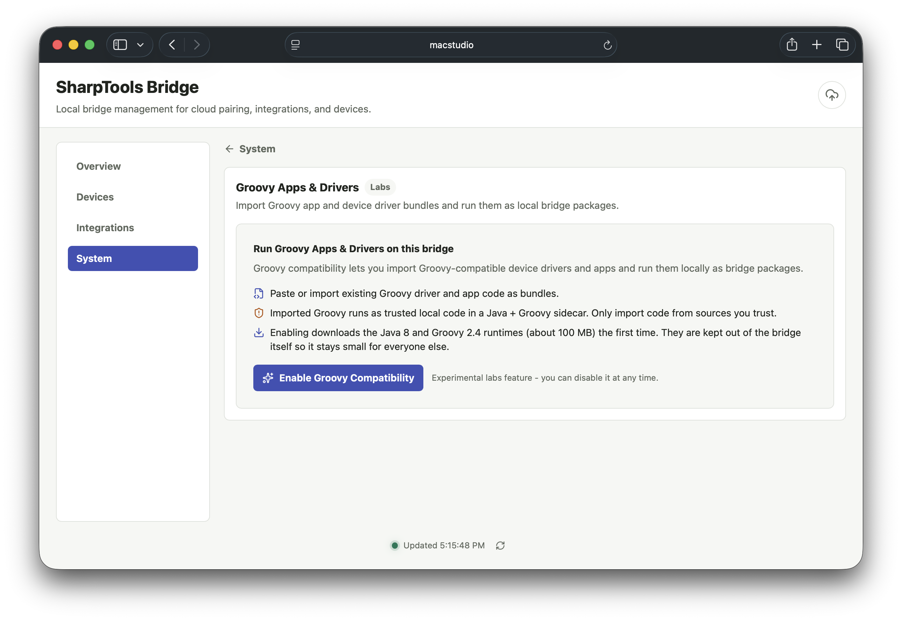
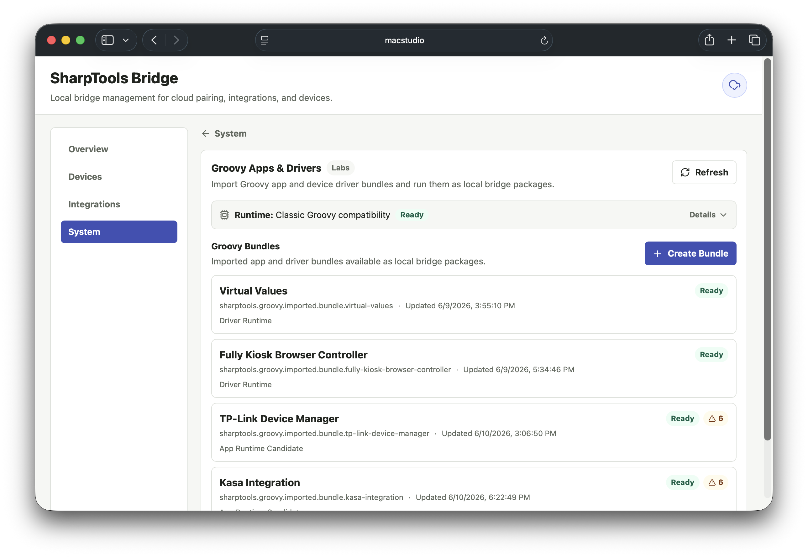
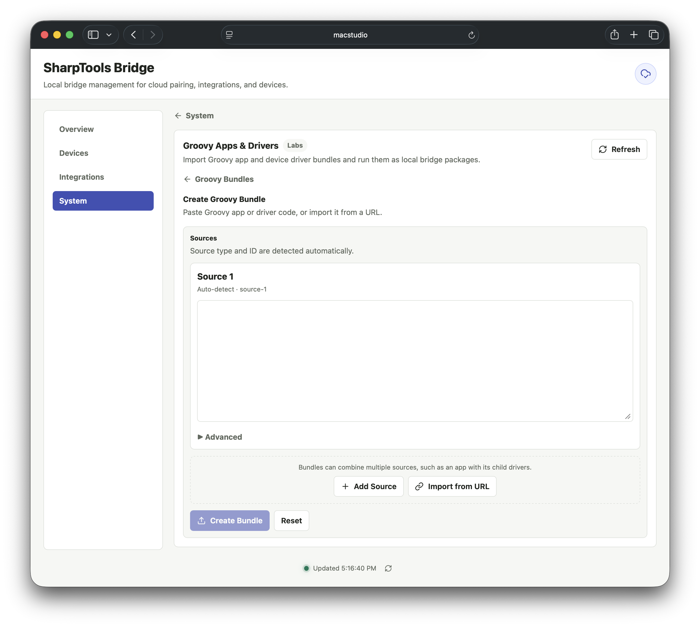
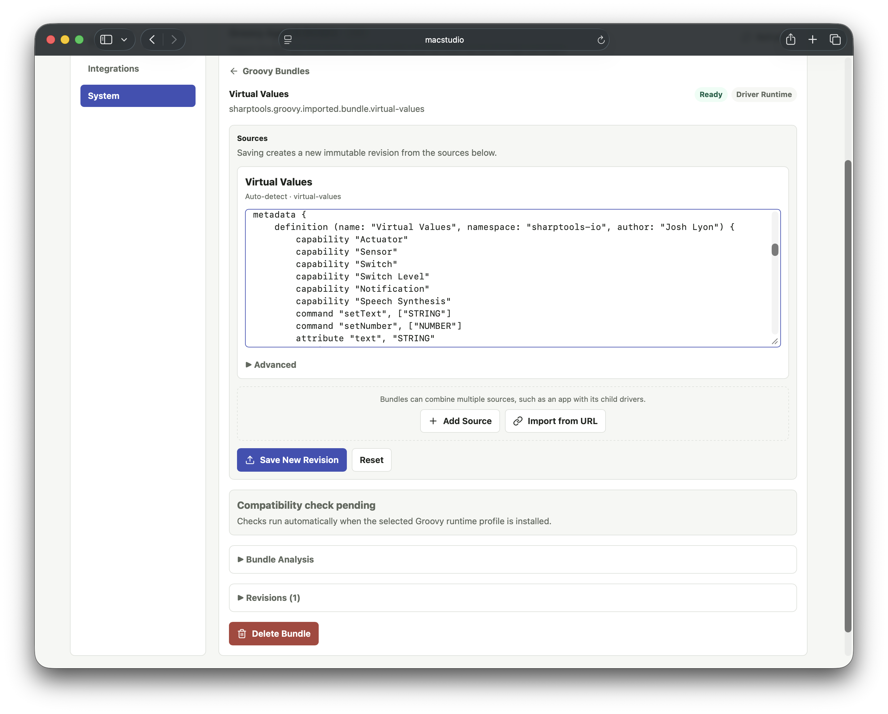

# Groovy Labs

Groovy Labs is an experimental compatibility layer for imported Hubitat/SmartThings-style community Groovy apps and drivers.

It is intended for trusted, network-oriented Groovy packages such as LAN, Wi-Fi, HTTP, TCP/UDP, WebSocket, or cloud API integrations. It is not a replacement hub for paired Zigbee or Z-Wave devices.

## What You'll Need

- Groovy Labs enabled from **System** > **Labs** in the Bridge admin UI.
- Groovy app and/or driver source from a trusted source.
- A package that communicates through network APIs rather than direct Zigbee or Z-Wave radio APIs.
- An expectation that some testing may be needed. Groovy compatibility is still experimental and some packages may need additional compatibility work.

## Setup

### Enable Groovy Labs

Open the Bridge admin UI and go to **System** > **Labs**. Enable the **Groovy Runtime** if it is not already enabled.

Bridge downloads and prepares the Groovy runtime behind the scenes when the Labs feature is enabled. Wait for the runtime to report ready before importing or using Groovy app and driver bundles.

### Manage Groovy App and Driver Bundles

1. Go to **System** > **Labs** > **Groovy**.
2. Create or update a Groovy app and driver bundle.
3. Add source files directly or fetch them from trusted URLs.
4. Review the compatibility analysis.
5. Activate the bundle when it is ready.

### Add a Device from an Installed Bundle

1. Go back to the main **Devices** tab.
2. Select **Add Device**.
3. Choose the installed Groovy package.
4. Complete the Groovy app or driver setup flow.
5. Use **Devices** > **Cloud Sync** to choose which created devices should sync to SharpTools.

## Resources and Capabilities

Groovy Labs runs compatible Groovy apps and drivers in Bridge. When a Groovy package creates devices or exposes supported capabilities, Bridge translates those into normal Bridge devices that can be selected for SharpTools Cloud Sync.

Standalone Groovy drivers usually create one device during the **Add Device** flow. Groovy app and driver bundles can create child devices as part of the app setup flow.

Supported capabilities depend on the Groovy package and what the compatibility layer can understand. Common mapped capabilities include:

- Switch, switch level, light, color control, color temperature, and color mode.
- Contact, water, motion, and temperature sensors.
- Thermostat mode, setpoints, and operating state.
- Scene.

Custom Groovy attributes and commands can be exposed when they are declared by the imported package and fit the compatibility layer. Button-like Groovy capabilities are currently deferred while event-source behavior is finalized.

## Supported Runtime Behavior

Groovy Labs includes support for common app and driver patterns, including:

- Preferences and settings forms.
- Dynamic app pages for compatible app setup flows.
- Child device creation from app bundles.
- Local state and private state persistence.
- Scheduled callbacks.
- App and child-device subscriptions for compatible packages.
- Synthetic hub and location data used by many network-oriented Groovy packages.
- LAN HubAction-style communication for supported LAN use cases.

If a package uses Groovy classes, methods, or platform behavior that Bridge does not support yet, please share the details in the SharpTools community. We expect the compatibility layer to expand based on real-world packages and feedback.

## Notes and Limitations

::: warning Zigbee and Z-Wave Devices
Groovy Labs does not add direct Zigbee or Z-Wave radio support to Bridge. Packages that require direct Zigbee or Z-Wave device pairing are not supported by Bridge.
:::

::: danger Trusted Local Code
Imported Groovy source should be treated like trusted local code. The compatibility analyzer is a helpful guardrail, not a security sandbox.
:::

Groovy Labs has been tested with a handful of network-oriented community Groovy apps and drivers, but compatibility is package-specific. Expect some packages to need additional compatibility work before they run cleanly in Bridge.

The compatibility analyzer can flag unsupported radio packages, risky source patterns, or app behavior that Bridge does not support yet. Review those results before activating a bundle.
