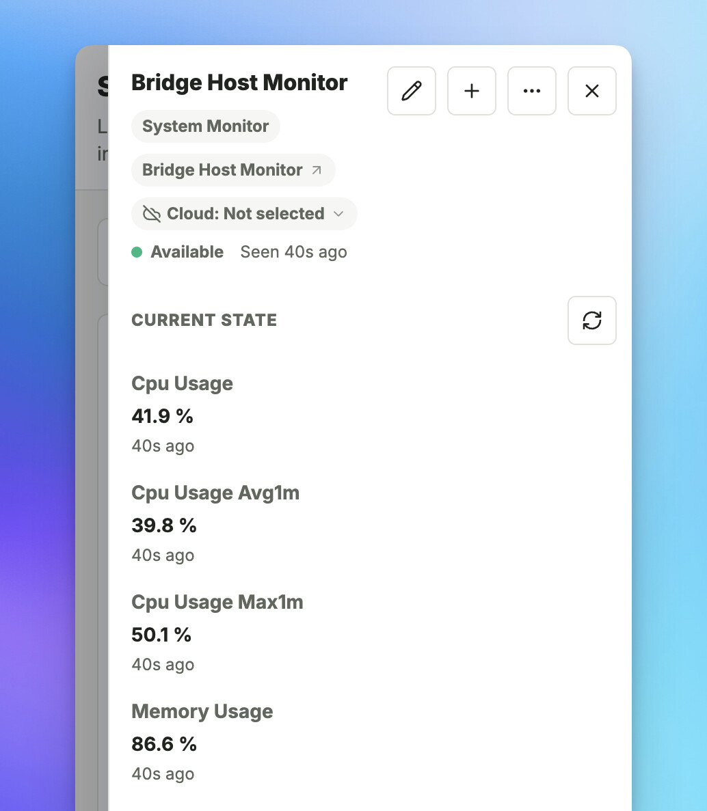

# Bridge Host Monitor

The Bridge Host Monitor integration exposes health and resource metrics from the system running SharpTools Bridge as a device for dashboards and rules.

## What You'll Need

- SharpTools Bridge running on Windows, macOS, Linux, or Docker.
- SharpTools Cloud connected if you want to use the monitor on remote dashboards or in rules.

No additional software, account, or network connection is required.

## Setup

1. Open the Bridge admin UI.
2. Select **Add Device**.
3. Find **Bridge Host Monitor** in the **Development** section.
4. Select **Add Bridge Host Monitor**.
5. Use **Devices** > **Cloud Sync** to select **Bridge Host Monitor** if you want it available in SharpTools.

Bridge creates one monitor device for the system where Bridge is running.

## Reported Metrics

The monitor reports:

- Current CPU usage, one-minute average CPU usage, and one-minute peak CPU usage.
- Memory usage, used memory, and available memory.
- Bridge process CPU usage and resident memory usage.
- Storage usage and available storage for the filesystem containing Bridge data.
- Bridge process uptime.
- Metric scope, such as `native`, `container`, `virtual`, or `unknown`.

Storage and memory values use readable units such as MB, GB, or TB. Uptime automatically uses seconds, minutes, hours, or days as appropriate.

  <figure>
    
    <figcaption>The Host Monitor appears as a selectable device with current and one-minute host metrics.</figcaption>
  </figure>

## Refresh Behavior

Bridge samples host metrics locally and publishes updated device values about once per minute. Short CPU samples are retained locally to calculate the one-minute average and peak values.

The first CPU reading after Bridge starts may need a short warm-up period because CPU usage is calculated from the difference between cumulative processor samples.

## Docker and Virtual Environments

Metrics describe the environment visible to the Bridge process. On a native Windows, macOS, or Linux installation, that is normally the host system. In Docker or another virtualized environment, memory, CPU, and storage values may reflect the container or virtual environment instead of the physical machine.

The `hostMetricScope` value indicates how Bridge classified the environment. Storage currently reports the filesystem containing the Bridge data directory rather than every disk or volume attached to the system.

## Notes and Limitations

- The Host Monitor is read-only and does not provide system-management commands.
- It is not selected for SharpTools Cloud Sync by default.
- Values are intended for lightweight dashboard and rule monitoring, not high-frequency performance analysis.
- Memory usage represents usable system memory estimates and should not be interpreted as operating-system memory pressure.
