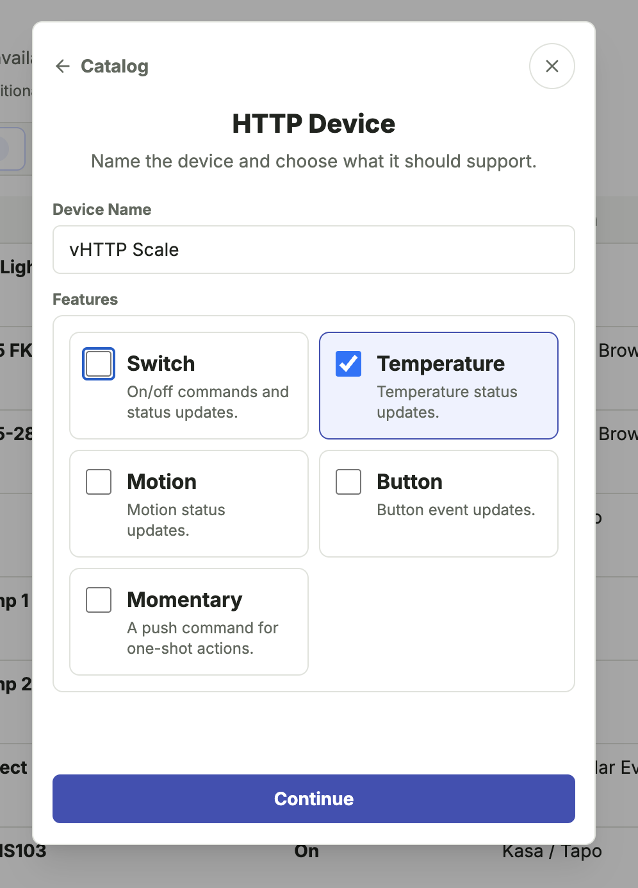
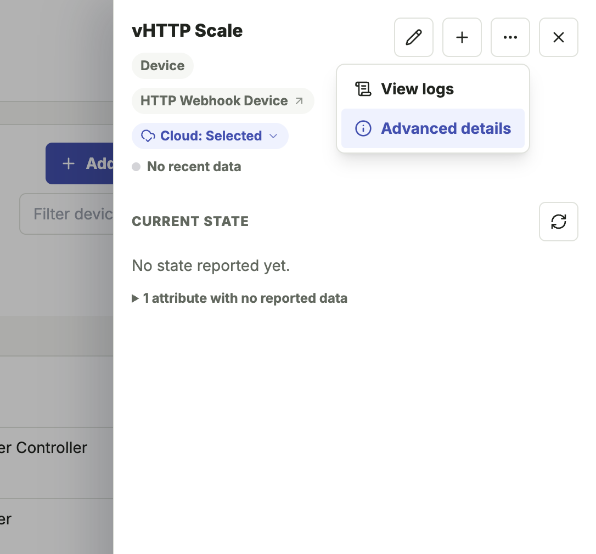
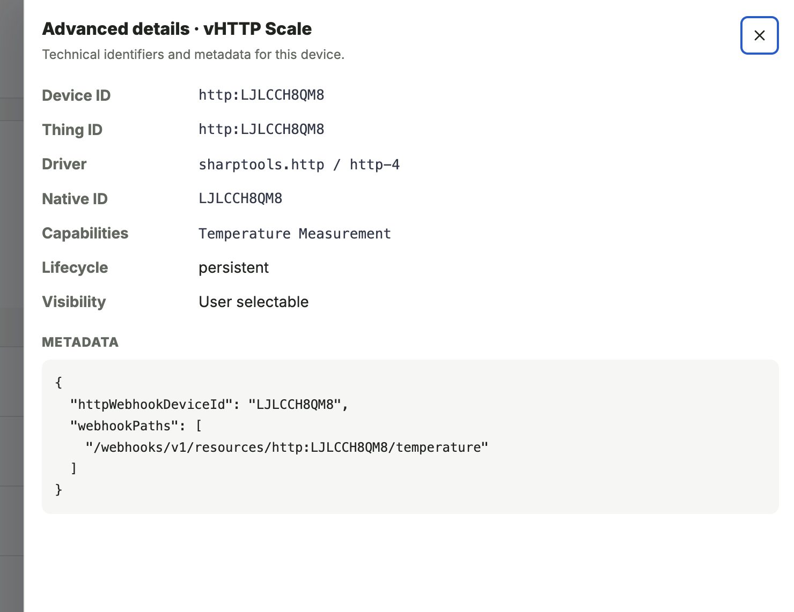

# HTTP Webhook Device

The HTTP Webhook Device integration creates virtual devices backed by local webhooks and optional local HTTP requests.

## What You'll Need

- A local device, service, script, or application that can send HTTP requests to Bridge.
- Optional local HTTP endpoints for commands that Bridge should call.
- A trusted local network path to the Bridge admin service.

::: warning Local Webhook Exposure
Webhook endpoints are intended for trusted local-network use. Do not expose Bridge directly to the internet.
:::

## Setup

1. Open the Bridge admin UI.
2. Select **Add Device**.
3. Choose **HTTP Webhook Device**.
4. Name the virtual device.
5. Choose one or more features.
6. On **Configure Commands**, optionally enter URLs that Bridge should call when command-capable features are used. See [Outbound Webhooks](#outbound-webhooks) below.
7. Save the generated webhook paths for your local device, service, or script. See [Webhook Paths](#webhook-paths) below.

If you are only using the device as a virtual device or only using inbound webhooks to update state, leave the command URL fields blank.



## How It Works

HTTP Webhook Devices can be used in a few different ways, and those patterns can be combined:

- **Virtual device state**: create a device with no external URLs configured. For example, a Switch feature can be toggled from SharpTools dashboards or rules, and Bridge keeps the on/off state internally.
- **Inbound webhooks**: another local device, script, or service on the same LAN or network as Bridge calls the generated Bridge webhook paths to update the device state or emit button events.
- **Outbound webhooks**: for command-capable features, Bridge can call another URL when a SharpTools dashboard or rule runs a command like `on()`, `off()`, or `push()`.

Inbound webhooks update Bridge state only. They do not call the outbound webhook URLs, which helps avoid loops when the external system is reporting its own state back to Bridge.

## Resources and Capabilities

Bridge creates one virtual device resource for each HTTP Webhook Device.

Supported features include:

| Feature | What It Adds | Inbound Webhooks | Outbound Webhooks |
| --- | --- | --- | --- |
| **Switch** | `on()` and `off()` commands with stored on/off state. | `/switch`, `/switch/on`, `/switch/off` | `on()`, `off()` |
| **Temperature** | Temperature Measurement attribute. | `/temperature` | None |
| **Motion** | Motion Sensor attribute. | `/motion`, `/motion/active`, `/motion/inactive` | None |
| **Button** | Button state and event updates with optional button number data. | `/button` | None |
| **Momentary** | `push()` command for one-shot actions. | None | `push()` |

The setup flow creates simple outbound `POST` requests for switch on/off and momentary push URLs when those URLs are provided.

## Webhook Paths

Webhook paths are generated for the device and selected features. Common paths include:

- `/webhooks/v1/resources/{resourceId}/switch`
- `/webhooks/v1/resources/{resourceId}/switch/on`
- `/webhooks/v1/resources/{resourceId}/switch/off`
- `/webhooks/v1/resources/{resourceId}/temperature`
- `/webhooks/v1/resources/{resourceId}/motion`
- `/webhooks/v1/resources/{resourceId}/motion/active`
- `/webhooks/v1/resources/{resourceId}/motion/inactive`
- `/webhooks/v1/resources/{resourceId}/button`

Use the Bridge host and port with the generated path. The full base URL looks like this:

```text
http://<bridge-host>:8787/webhooks/v1/resources/http:<uniqueId>
```

If you forget the paths, open the HTTP Webhook Device in Bridge and check **Advanced Details**. The paths also follow the format above, so you can reconstruct them from the resource ID.

<div class="screenshot-grid aspect-4/3">
  <figure>
    
    <figcaption>Open the device menu and select <strong>Advanced Details</strong>.</figcaption>
  </figure>
  <figure>
    
    <figcaption>Use the metadata section to find the generated webhook paths.</figcaption>
  </figure>
</div>

## Updating State with Webhooks

Webhook paths accept `GET`, `POST`, `PUT`, and `PATCH` requests. Values can be sent as query parameters, JSON bodies, form-encoded bodies, or plain text bodies.

The examples below show the feature path only. Prefix them with the full base URL shown above.

### Switch

Use the convenience paths when the desired state is already known, or send the state to the base switch path.

::: code-group

```http [Convenience]
POST /switch/on
POST /switch/off
```

```http [Query]
GET /switch?value=on
```

```http [JSON]
POST /switch
content-type: application/json

{ "value": "on" }
```

:::

Supported switch values:

| Resulting state | Accepted values |
| --- | --- |
| `on` | `on`, `true`, `1` |
| `off` | `off`, `false`, `0` |

::: details Alternative value keys
Use `value` for new integrations. Bridge also accepts `switch`, `state`, or `status` for compatibility with simple webhook senders.
:::

### Temperature

Temperature updates require a numeric value. Values are currently interpreted as Celsius (`C`).

::: code-group

```http [Query]
GET /temperature?value=10
```

```http [JSON]
POST /temperature
content-type: application/json

{ "value": 10 }
```

```http [Form]
POST /temperature
content-type: application/x-www-form-urlencoded

value=10
```

```http [Plain Text]
POST /temperature
content-type: text/plain

10
```

:::

Supported temperature values:

| Attribute | Accepted value |
| --- | --- |
| `temperature` | Any numeric value, such as `10` or `21.5` |

::: details Alternative value keys
Use `value` for new integrations. Bridge also accepts `temperature` or `temp`.
:::

::: warning Temperature Units
The HTTP Webhook Device currently labels this attribute as Celsius (`C`). It does not accept a unit or scale parameter and does not convert from the Bridge location temperature setting. Some workflows may use this as a simple numeric value and ignore the displayed unit.
:::

### Motion

Use the convenience paths when the desired motion state is already known, or send the state to the base motion path.

::: code-group

```http [Convenience]
POST /motion/active
POST /motion/inactive
```

```http [Query]
GET /motion?value=active
```

```http [JSON]
POST /motion
content-type: application/json

{ "value": "active" }
```

:::

Supported motion values:

| Resulting state | Accepted values |
| --- | --- |
| `active` | `active`, `motion`, `detected`, `true`, `1` |
| `inactive` | `inactive`, `clear`, `none`, `false`, `0` |

::: details Alternative value keys
Use `value` for new integrations. Bridge also accepts `motion`, `state`, or `status`.
:::

### Button

Call the button path to update the button state and emit a button event.

::: code-group

```http [Query]
POST /button?button=pushed&buttonNumber=1
```

```http [JSON]
POST /button
content-type: application/json

{
  "button": "held",
  "buttonNumber": 2
}
```

```http [Form]
POST /button
content-type: application/x-www-form-urlencoded

button=double&buttonNumber=1
```

```http [Plain Text]
POST /button
content-type: text/plain

pushed
```

:::

Use query parameters, JSON, or form-encoded data when you need to include `buttonNumber`. Plain text bodies are useful for the button value only.

Button numbers default to `1`. If a webhook reports a higher `buttonNumber`, Bridge updates the device's `numberOfButtons` state so the device can represent multi-button controllers.

Supported button values:

| Resulting button value | Accepted values |
| --- | --- |
| `pushed` | `pushed`, `push`, `tap`, `tapped`, `pressed`, `press`, `short_release`, `shortrelease`, `release`, `released`, or no button value |
| `held` | `held`, `hold`, `long_hold`, `longhold`, `long_press`, `longpress`, `long_release`, `longrelease` |
| `double` | `double`, `double_tap`, `doubletap`, `double_tapped`, `doubletapped`, `double_short_release`, `doubleshortrelease` |

::: details Alternative event keys
Use `button` for new integrations. Bridge also accepts `event`, `lastEvent`, `value`, or `state` for compatibility with existing webhook senders. Unrecognized values default to `pushed`.
:::

## Outbound Webhooks

The optional command URL fields are for HTTP requests that Bridge should send when a command runs from SharpTools. These are especially useful for LAN-only endpoints that SharpTools Cloud cannot reach directly.

- **On Command URL**: called with `POST` when `on()` runs.
- **Off Command URL**: called with `POST` when `off()` runs.
- **Push Command URL**: called with `POST` when `push()` runs.

For example, if a Switch feature has an On Command URL and Off Command URL, tapping the switch tile in SharpTools can update the Bridge device state and call the matching URL from the Bridge host.

Outbound webhook URLs can point to another local LAN service or to an internet endpoint. If you call an internet endpoint, that service will see the request coming from the network where Bridge is running, similar to any other outbound web request.

Inbound webhook paths do not trigger these outbound webhook URLs. For example, calling `/switch/on` updates the Bridge switch state to on, but it does not call the configured On Command URL.

## Common Patterns

**Virtual switch only**

Create a device with the Switch feature and leave both command URLs blank. The switch can be used in SharpTools dashboards and rules, and Bridge stores the on/off state internally.

**Local status endpoint**

Create a device with a feature like Temperature or Motion, then have another local system call the generated webhook path when the value changes.

**Dashboard button for a local HTTP action**

Create a device with the Switch or Momentary feature and configure the command URL. When SharpTools runs the command, Bridge sends the HTTP request from your local Bridge host.

**Two-way local control**

Configure outbound webhook URLs so SharpTools can control another local system. Also have that system call the inbound webhook paths when its real state changes. This keeps SharpTools and Bridge updated without causing command loops.

## Notes and Limitations

HTTP Webhook Device is best for simple local workflows. For a richer integration with discovery, credentials, device-specific commands, custom headers, request bodies, or complex state mapping, a native driver or Groovy Labs package may be a better fit.

Outbound webhook URLs configured during setup are simple `POST` requests. Bridge treats non-2xx responses as command failures.
