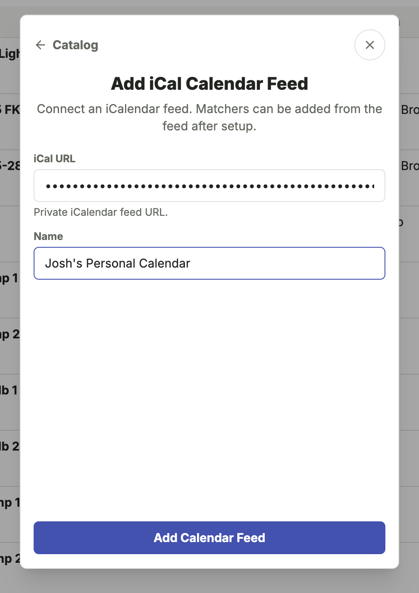
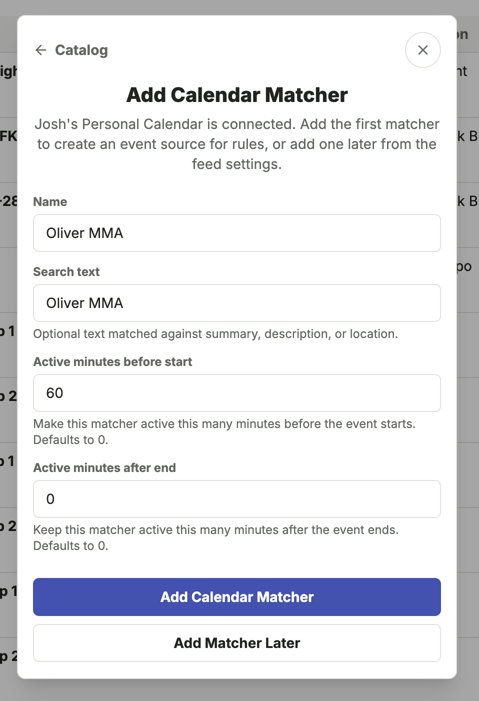
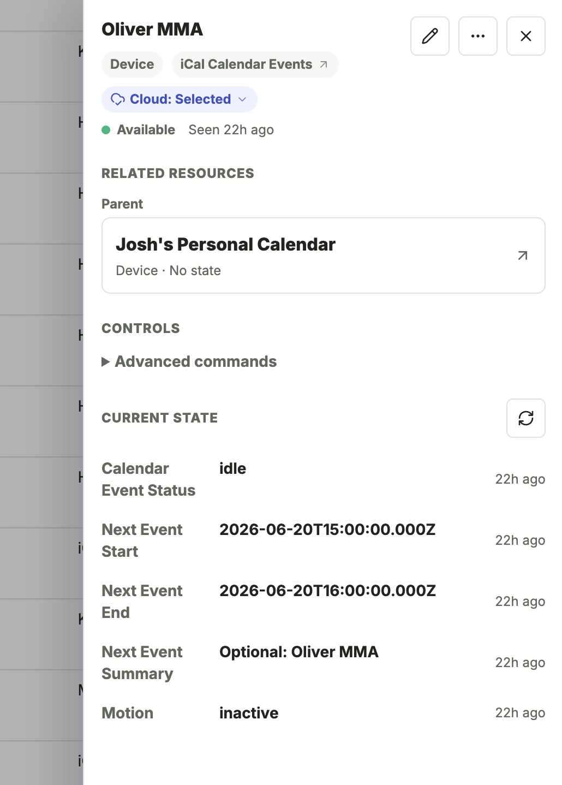

# iCal Calendar Events

The iCal Calendar Events integration turns matching calendar events into virtual devices for SharpTools dashboards and rules.

## What You'll Need

- A private iCalendar / ICS subscription feed URL that Bridge can fetch. The URL must return calendar data in iCalendar (`.ics`) format.
- A calendar or schedule that has events you want to use in dashboards or rules.
- One or more event patterns you want to match, such as a title, description, location, or category.

::: warning iCalendar Feed Required
Bridge cannot use a normal calendar webpage, browser view, or public sharing page. It requires an iCalendar / ICS feed URL from your calendar provider.
:::

::: tip Private Calendar URLs
Private iCalendar URLs can provide read access to your calendar feed. Treat them like passwords and avoid posting them publicly.
:::

## How It Works

Bridge uses two related resources for calendar events:

- **Calendar Feed**: the source calendar URL. This is local Bridge configuration and is not selected for SharpTools Cloud Sync.
- **Calendar Matcher**: a filtered virtual device created from a feed. Matchers are the resources you sync to SharpTools and use in dashboards or rules.

For example, you might add one feed named "Family Calendar", then create separate matchers for "Trash Day", "School Pickup", "Guest Stay", or "Vacation". Each matcher can have its own search text and active timing.

## Setup

1. Open the Bridge admin UI.
2. Select **Add Device**.
3. Choose **iCal Calendar Events**.
4. Add the private iCalendar / ICS feed URL and give the feed a name.
5. Add a calendar matcher for the events you want to use in SharpTools.
6. Give the matcher a name, optionally enter search text, and choose when it should become active before or after matching events.
7. Use **Devices** > **Cloud Sync** to choose which calendar matchers should sync to SharpTools.

After the first feed is added, you can add more matchers to the existing feed or add another calendar feed.

  <figure>
    
    <figcaption>Add the private iCalendar feed URL and name the calendar source.</figcaption>
  </figure>
  <figure>
    
    <figcaption>Create a matcher for the specific events you want to use in SharpTools.</figcaption>
  </figure>

## Common Uses

- **Trash or recycling reminders**: match events with "Trash" or "Recycling" and make the matcher active the evening before pickup.
- **School, sports, or activity schedules**: match a child's activity name and use the matcher as a rule condition.
- **Guest, travel, or vacation modes**: match calendar events that should change how dashboards or rules behave.
- **Service appointments**: match appointment names and trigger reminders or dashboard indicators.

## Resources and Capabilities

Bridge creates two kinds of resources:

- **Calendar Feed**: a local parent resource for the iCalendar source. Feed URLs are stored in Bridge's local secret storage. Feed parents are local configuration resources and are not cloud-selectable.
- **Calendar Matcher**: a child resource that filters events from a feed. Matchers are selectable for SharpTools Cloud Sync and can be used like other devices in SharpTools.

Calendar matcher resources expose:

- **Calendar Event** with `calendarEventStatus`, `nextEventStart`, `nextEventEnd`, and `nextEventSummary`.
- **Motion Sensor** with `motion` set to `active` while the matcher is active and `inactive` otherwise.

  <figure>
    
    <figcaption>A calendar matcher appears as a syncable device with calendar status, next event details, and motion-style active/inactive state.</figcaption>
  </figure>

## Status and Timing

The matcher status is based on the next matching event and the active window you configure.

| Status | Meaning | Motion |
| --- | --- | --- |
| `idle` | No matching event is currently active or upcoming. If a future matching event exists, the next event attributes still show it. | `inactive` |
| `upcoming` | A matching event is close to becoming active. The default upcoming lead time is 15 minutes before the active window starts. | `inactive` |
| `active` | A matching event is inside the active window. | `active` |

The active window starts at the event start time minus **Active minutes before start**, and ends at the event end time plus **Active minutes after end**.

For example, if a calendar event runs from 3:00 PM to 4:00 PM and the matcher has **Active minutes before start** set to `60`, the matcher becomes active at 2:00 PM. With the default 15 minute upcoming lead time, the matcher becomes `upcoming` at 1:45 PM.

## Matching Options

Matchers can search event summary, description, or location text. Search text is optional, so leaving it blank matches every future event in the feed.

Advanced matcher settings can also match iCalendar categories and control the upcoming lead time.

::: info Category Matching
Category matching depends on the actual iCalendar feed content. Some calendar apps hide or omit iCalendar `CATEGORIES` values, even when the calendar app itself has colors, labels, or categories.
:::

## Using Matchers in SharpTools

After a matcher is selected for SharpTools Cloud Sync, it can be used like other synced devices:

- Add it to a dashboard to show whether a matching event is idle, upcoming, or active.
- Use `calendarEventStatus` in rules to branch on `idle`, `upcoming`, or `active`.
- Use the Motion Sensor capability when you want a simple active/inactive condition.
- Use `nextEventSummary`, `nextEventStart`, or `nextEventEnd` when you want to display or evaluate the next matching event.

## Refresh Behavior

Calendar feeds are fetched on a configurable refresh interval. The default feed refresh interval is 15 minutes.

New, edited, or deleted calendar events appear in Bridge after the next feed refresh. Once events have been fetched, matcher timing is reevaluated locally, so active and upcoming transitions do not require the feed to be re-downloaded each minute.

You can adjust the feed refresh interval from the feed's advanced settings.

## Notes and Limitations

- Calendar feeds are read-only. Bridge does not create, edit, or delete events in the source calendar.
- Calendar feed resources are local configuration resources and may show no current state. Calendar matchers are the resources intended for SharpTools Cloud Sync.
- Events without an end time are treated as one-hour events for matcher timing.
- If a calendar provider rotates or revokes the private iCalendar URL, update the feed URL in Bridge.
