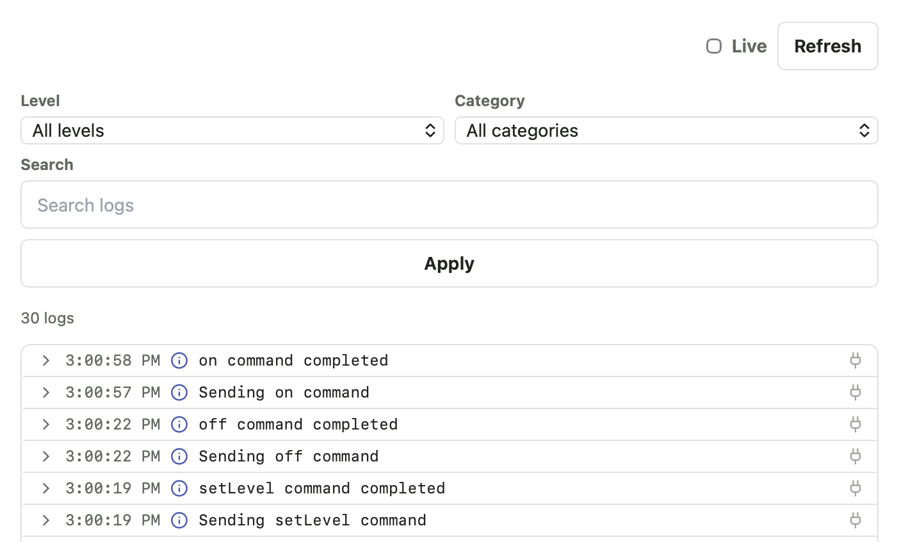

# Troubleshooting Bridge

The Bridge UI includes local logs and diagnostics so you can troubleshoot without relying only on terminal output.

## Check Bridge Status

Open the local Bridge UI:

```text
http://<bridge-host>:8787/
```

Start with:

- **Overview** for high-level setup status.
- **System > Cloud Connection** for SharpTools pairing status.
- **System > Updates** for update checks.
- **System > Info** for runtime and network details.
- **System > Logs** for troubleshooting details.

## Logs

Logs are stored locally and can be reviewed from **System > Logs**.

The log viewer provides options to filter by level and category or to search for specific text.



:::tip
Tap the **Live** checkbox to view a live stream of logs as they are processed
:::

Use logs when:

- Pairing fails.
- A device does not appear after Cloud Sync.
- A command fails.
- Discovery does not find a local device.
- An integration setup flow fails.
- Groovy Labs runtime installation or compatibility checks fail.


::: tip VIEW LOGS FOR SPECIFIC DEVICE OR INTEGRATION
When viewing an individual device or integration detail panel, you can tap the `...` button and select **View Logs** to view the logs scoped to that particular device or integration
:::

## Discovery Issues

Local discovery can be affected by:

- Docker networking mode.
- Docker Desktop port mapping.
- VLANs or guest networks.
- Firewall rules.
- mDNS or UDP broadcast limitations.
- Devices on a different subnet.

When discovery fails, try:

1. Use Linux host networking if running Docker on Linux.
2. Confirm the device and Bridge host are on the same local network.
3. Try manual host or IP setup if the integration supports it.
4. Check integration logs for discovery errors.

## Cloud Sync Issues

If a Bridge resource does not appear in SharpTools:

1. Confirm Bridge is connected in **System > Cloud Connection**.
2. Confirm the resource is selected for Cloud Sync.
3. Run a manual sync.
4. Check **System > Logs** for cloud or sync errors.
5. Check the integration detail logs for local device errors.

## Command Issues

If a command from SharpTools does not work:

1. Confirm the Bridge resource is still available locally.
2. Try the command from the Bridge UI if available.
3. Check the resource or integration detail logs.
4. Check **System > Logs** for command errors.
5. Confirm the device is still reachable from the Bridge host.

## Docker Issues

For Docker installs, check:

- The container is running.
- The data volume is still mounted.
- The Bridge UI port is reachable.
- Host networking is enabled when needed for discovery.
- Bind mount permissions allow UID `10001` to write to `/data`.

Useful commands:

```bash
docker ps
docker logs sharptools-bridge
docker compose pull
docker compose up -d
```

## Reset and Recovery

Bridge stores important local state in its data directory.

Do not delete the data directory unless you intentionally want to reset pairing, integrations, runtime state, secrets, and logs.

If you are troubleshooting a serious issue, capture logs before resetting.

## What to Include in Feedback

When reporting an issue, include:

- Bridge version.
- Install method.
- Host operating system.
- Docker networking mode, if using Docker.
- Integration or device being tested.
- What you expected.
- What happened instead.
- Relevant screenshots or logs.
