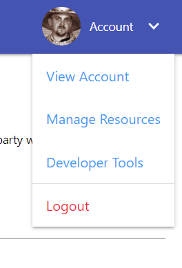

# Get started with Developer Tools

## Access Developer Tools
Developer Tools can be found in the User Menu drop-down list.

::: tip Info
A premium subscription is not required to access Developer Tools, but may be required to to use the developed resources. For example, Custom Tiles require a premium license for use in dashboards.
:::

Ready to try out the developer tools? Get started with [Custom Tiles](./custom-tiles/).