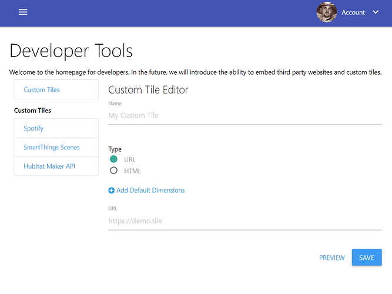

# Custom Tile

## Overview
Developers can create custom tiles to embed web page from other sites, or integrate with other services and custom styles
using the standard web technology and skills they are familiar with - HTML, CSS and JavaScript.

## Creating Custom Tiles
After tapping the Create button at the bottom of the Custom Tiles list, you’ll be taken to the page where you can create your first Custom Tile:

There are two types of Custom Tiles:
* **[URL](./url)**: points to an external webpage, and embed as an iFrame
* **[HTML](./html)**: develop the custom tile using HTML, CSS and JavaScript (hosted by SharpTools)

### Best Practices
Here are some best practices when working on Custom Tiles:

#### Test tiles without settings configured
For example, display a message suggesting the tile should be configured.
You can test this by either not filling out the preview settings or clearing out the settings before tapping continue in the Settings preview modal.

#### Prefer classic JavaScript syntax over modern ES6 syntax
This provides a wider range of compatibility with browser – especially considering that older Fire Tablets and iPads are commonly used as dashboard viewing devices.
Example: instead of arrow syntax ()=>{ } prefer traditional function declarations function(){ }

#### If using the ‘Default Dimensions’ option, take preference to the smallest reasonable size
When adding tiles to a dashboard, it’s generally preferred not to have a tile larger than the dashboard width added. For example, many mobile (portrait) dashboard users will only be showing 2 columns wide, so a 3 wide tile would extend beyond their dashboard.

#### Prefer dynamic measurements rather than fixed pixel sizes
Users retain the ability to adjust tile dimensions as they see fit, so also plan on accommodating larger or smaller tile sizes where reasonable
em, vh, or % sizes provide flexibility in scaling compared to px units and can be used with font sizes, div sizes, etc.
The ‘window’ size will be the size of the tile since the custom HTML is displayed in an iframe. This can be used as a helpful reference if you want to dynamically calculate sizes or use CSS @media queries