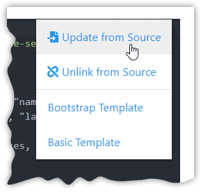

# Custom Tiles - HTML Type

Selecting the HTML type for a [Custom Tile](./) provides a script editor interface in which you can write standard HTML, JavaScript,
and CSS to build Custom Tiles. The HTML option also provides the option to define Tile Settings which you can then
access within your JavaScript.

## Introduction 
Because Custom Tiles use standard web technologies, you can use existing libraries and frameworks – Bootstrap, React,
Vue, Angular, Tailwind, etc. Or you can use regular (vanilla) HTML and JS.

<video width="80%" controls>
  <source src="../assets/custom_tile_html_ide_demo.mp4" type="video/mp4">
  Your browser does not support the video tag.
</video> 

## Settings
You can define settings for the Custom Tile which get exposed as additional options within the main
dashboard interface when you edit a tile. To use these within your scripts, you’ll want to use our [stio library](./stio-lib.md) as shown in the snippet below.

```html
<script src="https://cdn.sharptools.io/js/custom-tiles.js"></script>
<script>
    stio.ready(function(data){
       console.log('The user specified token is', data.settings.token)
    });
</script>
```

::: tip  
There are a variety of functions such as `showToast()`, `showList()` and `showForm()` which are included in the stio library. 
Check out the [stio library](./stio-lib.md) documentation for more details.  
:::

There are both primitive setting types like String, Numeric, and Boolean as well as enriched setting types like Things and Variables. Primitive setting types have the value directly exposed on the setting key. Enriched setting types enable you to interact with resources like Things and Variables from the SharpTools platform to read values, listen for updates, and send commands.


### Primitives
* **String**: Enables the user to input free form text. 
* **Numeric**: Enables the user to input numeric values. 
* **Boolean**: Enables the user to check/uncheck the setting.


### Things
You can define a SharpTools Thing as a setting within your Custom Tile. If you define which capabilities the device must have, the list of things presented to the user when configuring the tile setting will be filtered to devices which match that capability set. This is helpful for ensuring that the device selected by the user will have the attributes and commands you expect for use in your custom code. 

You can interact with the Thing using the [stio library](./stio-lib.md#things) to access attribute values, subscribe to attribute updates, and send device commands.


::: details Capability Filter Details
**Filters Match ALL**  
Please note that if you include more than one capability filter, only devices which match all of the filters are displayed to the user.

For example, if you include both `motionSensor` and `temperatureSensor` capabilities, the user must have a device which implements both of those capabilities. If you want access to a separate motion device and separate temperature device, you'll want to define each as their own setting.


**Autocomplete + Custom Capabilities**  
We've included a list of ~20 popular capabilities as autocompletion values. If you start typing a capability and it matches one of these, you'll be able to select it directly from the drop down.

If you want to use a Custom Capability or a capability that otherwise doesn't exist in the autocompletion list, just type your custom capability and press Enter. Note that you must use the `camelCase` formatted ID of the capability.

::: tip 
💡 The [SmartThings capabilities documentation](https://developer.smartthings.com/docs/devices/capabilities/capabilities-reference) is a good reference point for capability identifiers even for other platforms we support like Homey and Home Assistant.  

:::


### Variables
You can define a SharpTools Variable as a setting within your Custom Tile. You must select the specific type of variable to restrict the variable selection to.

You can interact with the Variable using the [stio library](./stio-lib.md#variables) to access the variable value, subscribe to variable updates, and set/update the attribute value.


## Preview
When you use the ‘Preview’ button, it will render a copy of the tile below the script editor interface. If you have
any Tile Settings defined, you’ll be prompted for which values you want to use for the settings (simulating what the
tile would be like after the user adds the tile to their dashboard and configures it).


## Import Code
You can 'import' a Custom Tile by either manually copying in the HTML code or using a special import URL. If you copy in code with embedded settings, the system will automatically import tile settings (or prompt you to do so) once you tap out of the editor.

**Import URL Format**
```
https://sharptools.io/developer/custom-tiles/import/?url={{URL_TO_RAW_SOURCE_HTML}}
```

::: warning
Please be cautious when copying or importing the HTML code from others. Always review the code, and make sure you are 
comfortable with the implementation details. SharpTools does not review and is not responsible for the custom tile HTML
shared by other developers.
:::

## Update Imported Code
Many developers will release updates and enhancements to existing Custom Tiles. These updates are *not* automatically pushed to your account. Instead, you retain control of if and when you would like to update your copy of the custom tile.
1. Open your [Custom Tile developer tools](https://sharptools.io/developer/custom-tiles/)
1. Select the custom tile that you imported previously
1. Scroll down to the source code editor, tap the :gear: in the top-right corner of the code editor and select '**Update from Source**'  
   
1. Scroll down and press **Update** at the bottom of the screen to save the changes  
   


Looking for some inspiration? Check out the sample tiles we've put together:

::: tip EXAMPLES
[Community Post: Sample Custom Tiles](https://community.sharptools.io/t/custom-tiles-third-party-integrations/6591/2)
:::
