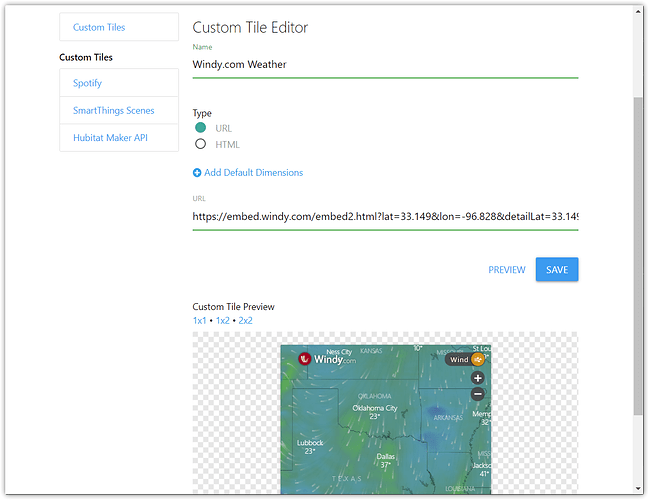

# Custom Tiles - URL Type 

Selecting the URL type for a Custom Tile is fairly straightforward as it effectively embeds the target website in a tile via an `iframe`.

If you paste in an iframe embed snippet, the input will attempt to grab the URL whenever you tap preview.
Many websites offer an ‘embed’ option which provides an iframe tag. For example, on 
<a href="https://windy.com/" target="_blank">Windy.com</a> you can tap the menu in the top left and choose **embed**.
The embed code that's provided is that of an `<iframe>`, so you can either manually copy just the ‘src’ attribute or copy
in the whole tag and the developer tools will automatically grab it for you.

<video width="80%" controls>
  <source src="../assets/custom_tiles_iframe_parsing.mp4" type="video/mp4">
  Your browser does not support the video tag.
</video> 

::: tip Info
The [stio library](./stio-lib.html) works with URL tiles too, but we don’t expose the ability to configure
settings for the URL option (yet!)
:::